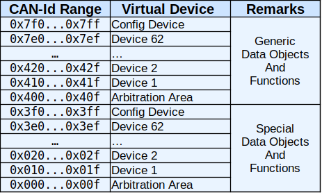

Terms and Basics
===

Device Object
---
A device object is a collection of data points that is assigned to a specific functionality. For example, a GPS device object provides the current position, time and other information. It is important to note that these are virtual entities. A real device can combine several virtual device objects. For example, a Flarm device provides both the GPS device object and a device object with information on relative positions to other gliders. All device objects have a uniform size of 16 specific and 16 generic Ids.

Arbitration Area
---
The arbitration area is a special virtual device object that is used to organize the Can bus. In particular, this device object is important during start-up. The arbitration area is assigned a high priority.

Configuration Device Object
---
The configuration device object is a special virtual device object that can optionally be used to make changes to the system and save software updates. This device object is assigned a low priority so that it cannot interfere with ongoing real-time operation. Only one configuration device object may be active at any one time.

ID Allocation
---
The basic CAN bus frame format with 11 identifier bits is used. This means that a total of 2048 IDs are available. This area is divided into areas with 32 IDs, a total of 64 device objects can be used. As two additional special device objects are defined, 62 virtual devices can be used in real terms.

Splitting the ID Range of a Device Object
---
The ID range of a device object comprises 32 IDs. The ID area is divided into generic and specific part. The generic IDs are defined in the same way for all devices. The underlying functions are available regardless of the device. For example, this enables the firmware update of the device or the general option of setting genral parameters such as vario volume. The specific IDs are reserved for functions and services that are defined in relation to the function of the device.

The IDs from 0x400 to 0x7ff are reserved for generic data points, the IDs 0x010 to 0x3ef are assigned to specific data or functions of device objects. The range from 0x000 to 0x00f is reserved for the virtual master device, the range from 0x3f0 to 0x3ff for the virtual configuration device.

This division makes it very easy to assign a received message as to whether it is a specific or a generic message. The hardware-based filters available in Can bus peripherals can be used to filter out the desired CAN bus datagrams.

